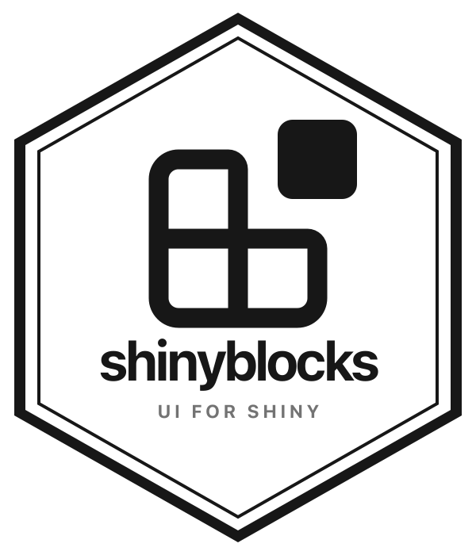

# shinyblocks 

[](https://github.com/nvelden/shinyblocks/actions/workflows/ci.yml)
[](https://github.com/nvelden/shinyblocks)
[](LICENSE)

`shinyblocks` is an experimental R package for building modern Shiny
dashboards with composable, accessible UI blocks inspired by shadcn/ui.
It is designed for R/Shiny authors who want polished dashboard layouts,
forms, overlays, navigation, theming, and runtime interactions without
adding a Node, Tailwind, Vite, or React build step to their app.

The package is not on CRAN yet, and the public API may change before the
first stable release.

[Documentation and component gallery](https://nvelden.github.io/shinyblocks/)

## Installation

Install the development version from GitHub:

```r
install.packages("pak")
pak::pak("nvelden/shinyblocks")
```

## Quick Example

```r
library(shiny)
library(shinyblocks)

ui <- block_page(
  title = "Operations",
  sidebar = block_sidebar(
    title = "shinyblocks",
    block_nav_item("Overview", icon = "layout-dashboard", selected = TRUE),
    block_nav_item("Reports", icon = "file-text")
  ),
  header = block_header(
    "Operations dashboard",
    block_dark_mode_toggle()
  ),
  block_card(
    title = "Revenue",
    description = "+8% from last week",
    value = "$42,100"
  ),
  block_field(
    block_field_label("Region", `for` = "region"),
    block_select(
      "region",
      choices = c("Americas", "EMEA", "APAC"),
      selected = "Americas"
    )
  )
)

server <- function(input, output, session) {}

shinyApp(ui, server)
```

## Component Gallery

Run the local showcase app from an installed package checkout:

```r
shinyblocks::run_showcase()
```

The hosted documentation and gallery are available at
<https://nvelden.github.io/shinyblocks/>.

## Use With Shinylive

`shinyblocks` can be used in Shinylive/webR apps before the package is
available through CRAN or the default webR package repositories by
mounting the package filesystem image published with a GitHub release.

Download `library.data.gz` and `library.js.metadata` from a
`shinyblocks` release, place both files in a public folder in your
Shinylive export, for example `wasm_binaries/`, then mount the image
before calling `library(shinyblocks)`:

```r
if (!"shinyblocks" %in% installed.packages()[, "Package"]) {
  dir.create("/packages", recursive = TRUE, showWarnings = FALSE)
  webr::mount("/packages", "/wasm_binaries/library.data.gz")
  .libPaths(c("/packages", .libPaths()))
}

library(shiny)
library(shinyblocks)
```

Use a root-relative mount path such as `/wasm_binaries/library.data.gz`.
Relative paths can be resolved inside Shinylive's generated app
directory and may fail with missing `library.js.metadata` errors.

The current prerelease assets are attached to
<https://github.com/nvelden/shinyblocks/releases/tag/v0.0.0.9003>.
The first Shinylive load can take a little longer while webR downloads
and caches the package image.
