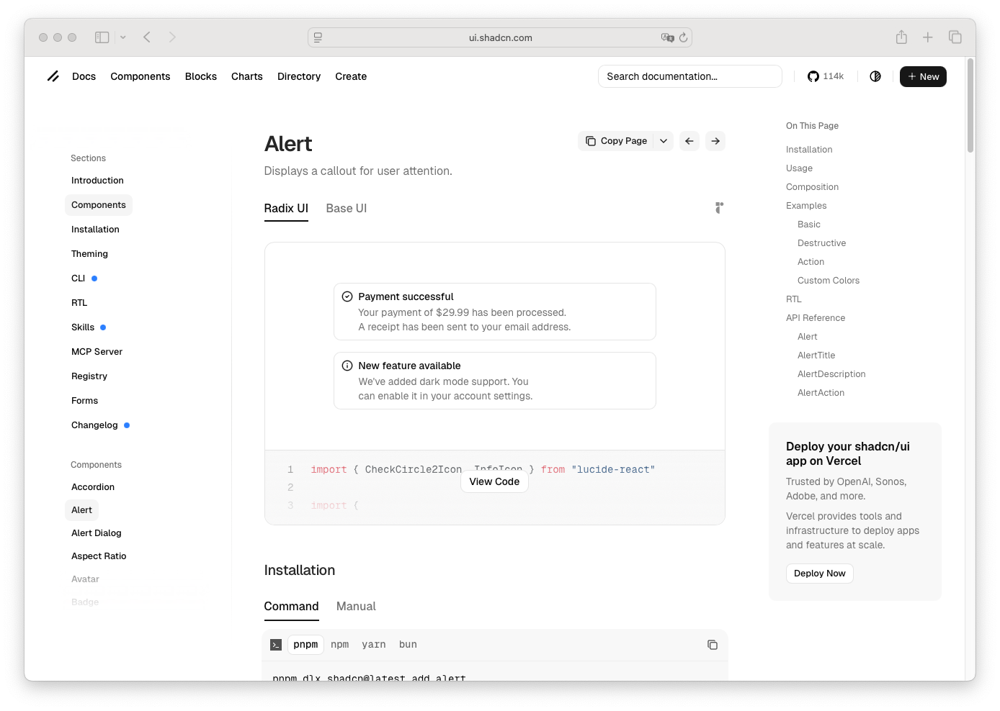

# Alert Description

> Shinyblocks function: `block_alert_description()`
> Shadcn reference: <https://ui.shadcn.com/docs/components/alert>

## States

- **default** — compact supporting text beneath the alert title.
- **destructive** — inherits the destructive context from the parent
  alert.
- **composed** — intended to be rendered inside `block_alert()`.

## Token contract

| Visual role | Token |
| --- | --- |
| Description text | `--muted-foreground` |
| Destructive text | inherits parent destructive treatment |

## Deliberate divergences from shadcn

- shadcn does not expose a standalone AlertDescription page; this is a
  composition helper around the alert content contract.

## Reference screenshot

Captured from <https://ui.shadcn.com/docs/components/alert> on 2026-05-11.
Refresh and update the date whenever shadcn updates the canonical look.
