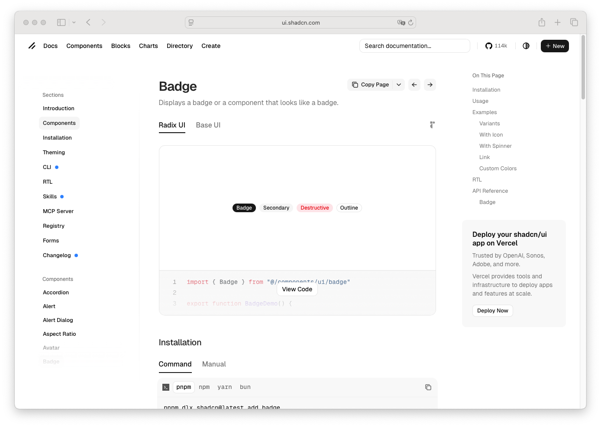

# Badge

> Shinyblocks function: `block_badge()`
> Shadcn reference: <https://ui.shadcn.com/docs/components/badge>
> Status: Runtime presentational component; Phase 7 spec refreshed
> around the shipped variant contract and parity normaliser notes.

## States

- **default** — compact pill with `--primary` surface and
  `--primary-foreground` text.
- **secondary** — `--secondary` surface and `--secondary-foreground` text.
- **outline** — transparent surface with 1px `--border` outline and
  `--foreground` text.
- **destructive** — `--destructive` surface with white text and a
  dark-mode dimming treatment aligned with shadcn's
  `dark:bg-destructive/60`.

## R API

| Argument | Purpose |
| --- | --- |
| `label` | Badge content. Accepts a string, an `htmltools` tag, or a tag list. Serialised through `html_fragment()`. |
| `variant` | One of `default`, `secondary`, `outline`, `destructive`. |
| `class` | Extra classes merged onto the runtime wrapper. |

There is no `update_block_badge()` — badge is purely presentational.

## Runtime mapping

| R input | Runtime payload |
| --- | --- |
| `label` | `props$labelHtml` (HTML fragment) |
| `variant` | `props$variant` |
| `class` | `className` |

## Token contract

| Visual role | Token |
| --- | --- |
| Default surface | `--primary` |
| Default text | `--primary-foreground` |
| Secondary surface | `--secondary` |
| Secondary text | `--secondary-foreground` |
| Outline border | `--border` |
| Destructive surface | `--destructive` |
| Destructive text | `--destructive-foreground` |
| Focus ring | `--ring` |

## Parity normalisation notes

The runtime CSS and the Tailwind v4 reference page produce visually
identical badges but differ in two computed-style idioms. Both are
normalised in `tools/parity/normalise.mjs`:

- **`border-radius`** — Tailwind v4 emits `rounded-full` as
  `calc(infinity * 1px)`, which Chromium computes to ~`3.35544e+07px`.
  The runtime uses an explicit `9999px`. Any `border-radius >= 9999px`
  collapses to the sentinel `"pill"` for diffing.
- **`display`** — Tailwind v4 emits `inline-flex` using the two-value
  syntax `display: inline flex`, which Chromium's `getComputedStyle`
  reports as `flex`. The runtime uses single-keyword `inline-flex`.
  The normaliser collapses `flex`, `inline-flex`, and `inline flex` to
  canonical `inline-flex`.

The dark-mode destructive tint (`color-mix(... 60%, transparent)`) is
implemented in `frontend/src/styles/runtime.css` to match
`dark:bg-destructive/60` upstream.

## Deliberate divergences from shadcn

- `block_badge()` is a plain content primitive. If a consumer wants a
  clickable badge they compose it outside the helper (e.g. inside a
  `block_button(variant = "ghost")`).
- The runtime does not register a binding — badge never reads or
  receives Shiny messages.

## Reference screenshot

Captured from <https://ui.shadcn.com/docs/components/badge> on 2026-05-11.
Refresh and update the date whenever shadcn updates the canonical look.
