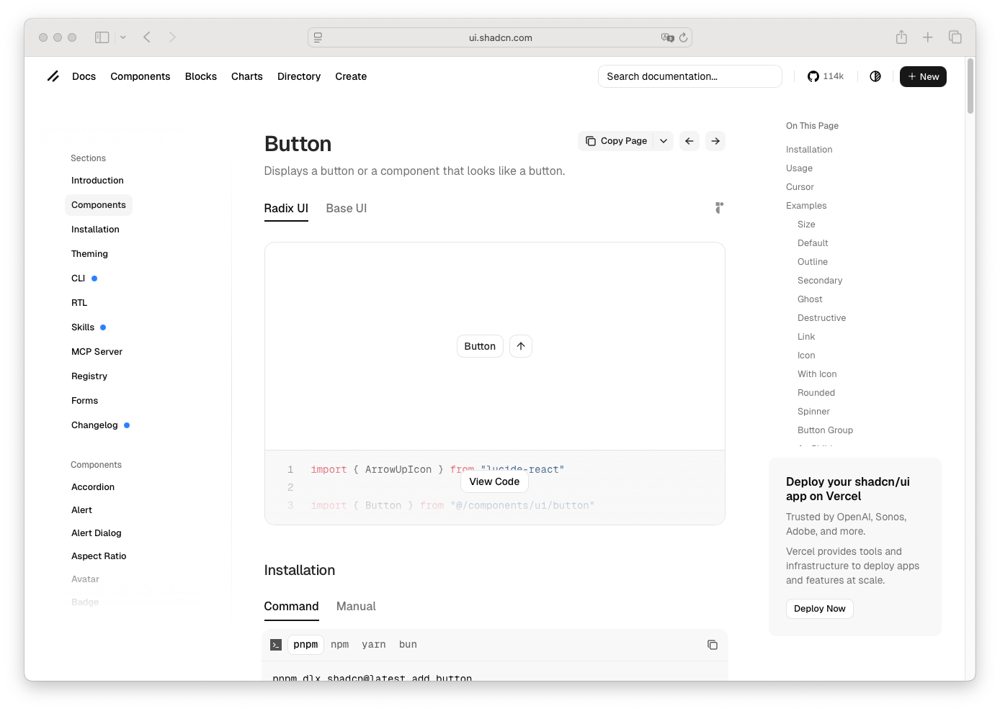

# Button

> Shinyblocks function: `block_button()`
> Shadcn reference: <https://ui.shadcn.com/docs/components/button>

## States

- **default** — solid `--primary` fill, `--primary-foreground` label,
  no border. Hover dims to ~90% opacity, no fill change.
- **secondary** — `--secondary` fill, `--secondary-foreground` label,
  same hover treatment.
- **outline** — transparent fill, 1px `--input` border, `--foreground`
  label. Hover swaps to `--accent` fill + `--accent-foreground`.
- **ghost** — transparent fill, no border, `--foreground` label. Same
  hover treatment as outline.
- **destructive** — `--destructive` fill, `--destructive-foreground`
  label, hover dim.
- **link** — no fill, no border, underline-offset 4 on hover.
- **focus-visible** — 2px outline at `--ring`, offset 2.
- **disabled** — `pointer-events: none`, opacity `0.5`. Applies across
  all variants.
- **with icon** — leading or trailing 1rem icon from the vendored
  Lucide sprite, `gap-2` between icon and label.
- **size = icon** — square 9-spacing-unit footprint, `p-0`, label slot
  empty in practice.

## Token contract

| Visual role | Token |
| --- | --- |
| Default fill | `--primary` |
| Default label | `--primary-foreground` |
| Secondary fill | `--secondary` |
| Secondary label | `--secondary-foreground` |
| Outline border | `--input` |
| Outline / ghost hover fill | `--accent` |
| Outline / ghost hover label | `--accent-foreground` |
| Destructive fill | `--destructive` |
| Destructive label | `--destructive-foreground` |
| Focus ring | `--ring` |
| Radius | `--radius-md` |

## Deliberate divergences from shadcn

- Always emits `type="button"` so the control never accidentally
  submits a parent form. shadcn-react inherits the React form
  semantics; htmltools doesn't, so we set it explicitly.
- Hover on solid variants uses an opacity dim instead of shadcn's
  `bg-primary/90` colour-mix. Equivalent visual result, simpler CSS.

## Reference screenshot

Capture pending — pull the canonical screenshot from
<https://ui.shadcn.com/docs/components/button> showing all six
variants in default state, then commit alongside this file. Refresh
and update the date whenever shadcn updates the canonical look.
