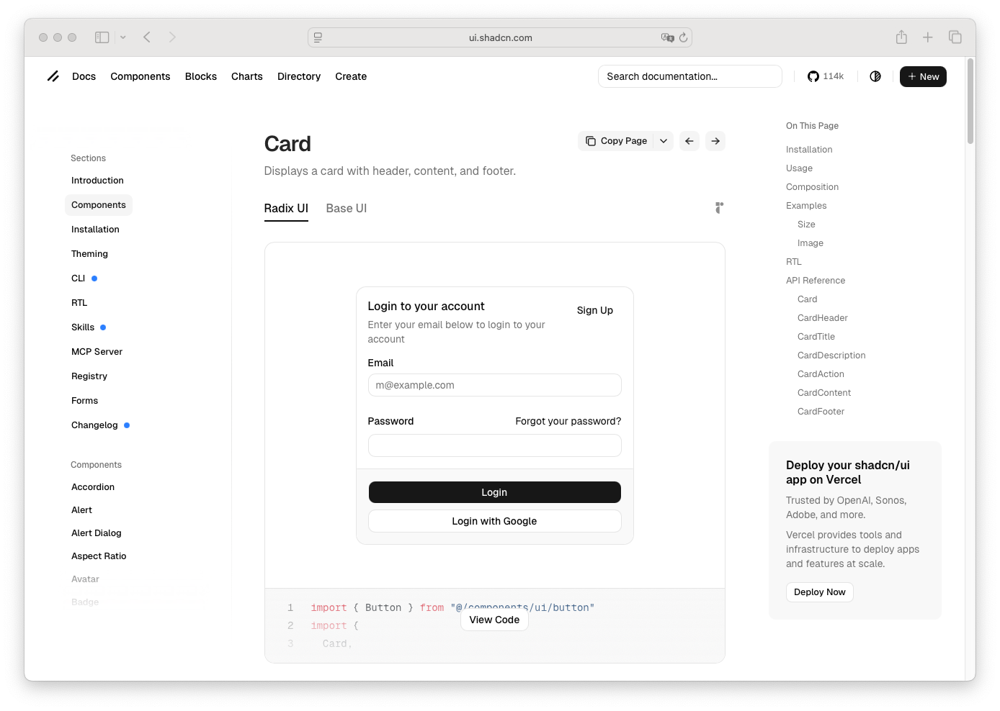

# Card Footer

> Shinyblocks function: `block_card_footer()`
> Shadcn reference: <https://ui.shadcn.com/docs/components/card>

## States

- **default** — bottom region for actions or summary text.
- **action-row** — typically hosts button actions aligned with the card
  layout spacing.

## Token contract

| Visual role | Token |
| --- | --- |
| Surface | inherited `--card` |
| Foreground | inherited `--card-foreground` |

## Deliberate divergences from shadcn

- shinyblocks exports the footer as a standalone helper so R callers can
  build card compositions incrementally.

## Reference screenshot

Captured from <https://ui.shadcn.com/docs/components/card> on 2026-05-11.
Refresh and update the date whenever shadcn updates the canonical look.
