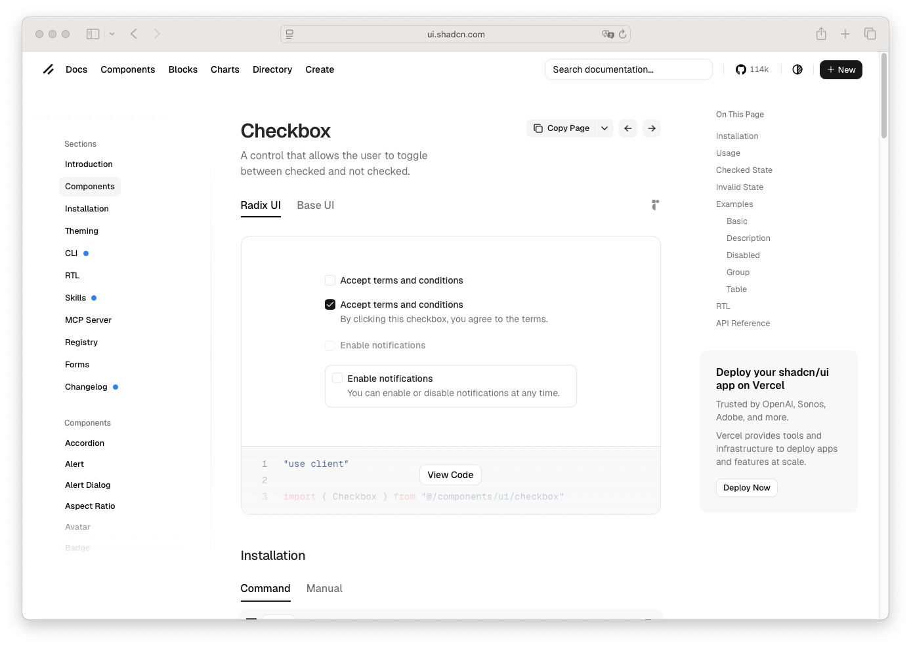

# Checkbox

> Shinyblocks function: `block_checkbox()`
> Shadcn reference: <https://ui.shadcn.com/docs/components/checkbox>

## States

- **default** — square control with border, subtle shadow, and inline
  label text.
- **checked** — primary-filled surface with a visible check mark.
- **focus-visible** — 3px `--ring` shadow at 50% opacity with the
  indicator border promoted to `--ring`.
- **disabled** — reduced opacity for both indicator and label.
- **invalid** — destructive-tinted border when wrapped in
  `block_field_invalid()`.

## Token contract

| Visual role | Token |
| --- | --- |
| Surface | `--background` |
| Text | `--foreground` |
| Border | `--input` |
| Checked fill | `--primary` |
| Check mark | `--primary-foreground` |
| Focus ring | `--ring` |
| Invalid border | `--destructive`, `--border` |

## Deliberate divergences from shadcn

- `block_checkbox()` wraps `shiny::checkboxInput()` and preserves the
  native checkbox input for Shiny bindings instead of using Radix state
  attributes.

## Reference screenshot

Capture pending — pull the canonical screenshot from
<https://ui.shadcn.com/docs/components/checkbox> and refresh it when
the upstream component changes.
