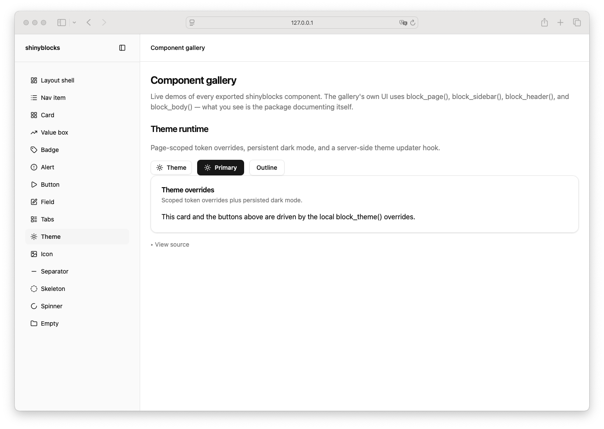

# Dark Mode Toggle

> Shinyblocks function: `block_dark_mode_toggle()`
> Shadcn reference: dark-mode toggle pattern built from Button +
> theme switching conventions
> Status: thin R-side wrapper around runtime `block_button()`; Phase 7
> spec refreshed around the shipped theme-runtime delegation contract.

## States

- **default** — outline-variant runtime button with sun + moon icons
  and a label. Carries `data-sb-theme-toggle="true"`.
- **light** — sun icon visible while the document resolves to light.
- **dark** — moon icon visible while the document resolves to dark.
- **hover** — follows the runtime outline button hover treatment.
- **focus-visible** — follows the runtime button's 3px `--ring` shadow
  at 50% opacity.
- **pressed** — the package theme runtime updates `aria-pressed` to
  reflect whether dark mode is currently active.

## R API

| Argument | Purpose |
| --- | --- |
| `label` | Visible label text. Defaults to `"Theme"`. |
| `class` | Extra classes merged onto the button. Always carries `sb-dark-mode-toggle`. |

## Composition

`block_dark_mode_toggle()` is implemented as:

```r
block_button(
  label = tagList(sun_icon, moon_icon, label_span),
  variant = "outline",
  size = "sm",
  class = "sb-dark-mode-toggle",
  `data-sb-theme-toggle` = "true",
  `aria-pressed` = "false"
)
```

So every visual contract (variants, sizes, focus ring, hover
treatment, disabled state) flows through the runtime `block_button()`.
The helper layers only the dual-icon swap and the theme-toggle marker
on top.

## Runtime behavior

- The package `shinyblocks.js` runtime delegates click handling for
  any `[data-sb-theme-toggle]` element: clicks cycle the active theme
  mode through the same path as `update_block_theme()`.
- The runtime updates `aria-pressed` on the toggle so screen readers
  announce the current state.
- Sun/moon visibility is driven by scoped CSS that keys off the
  document's resolved `data-theme` attribute.

## Token contract

Visual tokens are inherited from the runtime `block_button()`
outline-variant contract: `--background`, `--input`, `--accent`,
`--accent-foreground`, `--ring`.

## Deliberate divergences from shadcn

- shadcn does not ship a canonical standalone dark-mode-toggle
  component; this is a shinyblocks convenience helper built from the
  same button + theme conventions.
- The helper does not own its own visual CSS — Phase 6 cleanup removed
  legacy `.sb-button*` shell rules. Visual contract delegation to the
  runtime button is now the only path.

## Reference screenshot



Captured from the local shinyblocks showcase on 2026-05-11.
Refresh and update the date whenever the shinyblocks reference treatment changes.
