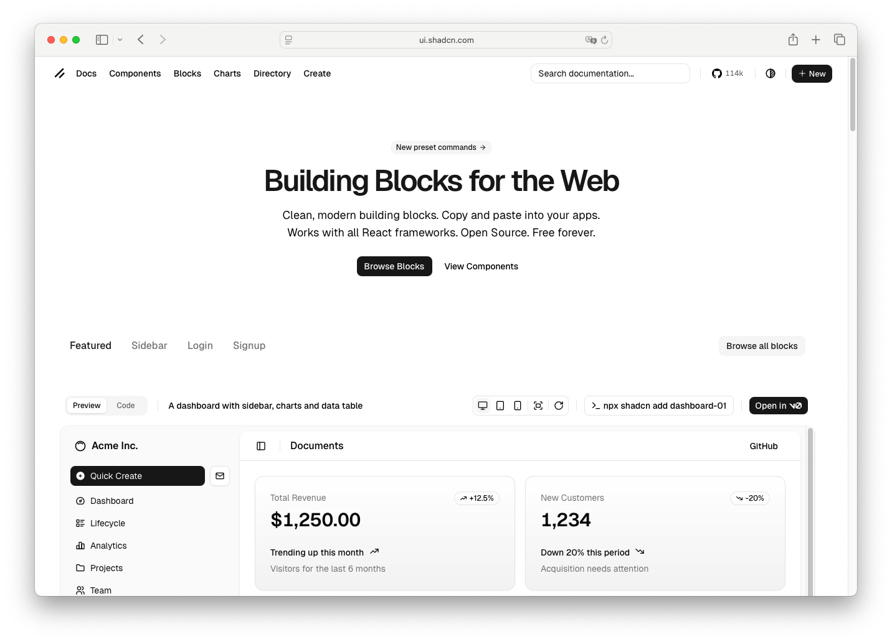

# Empty

> Shinyblocks function: `block_empty()`
> Shadcn reference: <https://ui.shadcn.com/blocks>
> Status: Runtime composition primitive; Phase 7 spec refreshed around
> the shipped title/description/icon/content/action slot contract.

## States

- **default** — centered empty-state composition with title and
  optional description.
- **with-icon** — optional leading icon in the empty-state icon slot.
- **with-action** — action area below the message for recovery CTA
  (typically a `block_button()`).
- **with-extra-content** — additional body content via `...`.

## R API

| Argument | Purpose |
| --- | --- |
| `title` | Empty-state title. String or tag. Required. |
| `...` | Additional empty-state body content rendered below the description. |
| `description` | Optional description text. |
| `icon` | Optional icon tag or vendored icon name. Forced to `inline-start` placement. |
| `action` | Optional action content (usually a button). |
| `class` | Extra classes merged onto the runtime wrapper. |

## Runtime mapping

| R input | Runtime payload |
| --- | --- |
| `title` | `props$titleHtml` |
| `description` | `props$descriptionHtml` |
| `...` | `props$contentHtml` |
| `icon` | `props$iconHtml` |
| `action` | `props$actionHtml` |
| `class` | `className` |

## Token contract

| Visual role | Token |
| --- | --- |
| Surface | `--background` |
| Title text | `--foreground` |
| Description text | `--muted-foreground` |

## Deliberate divergences from shadcn

- `block_empty()` packages a recurring app pattern as one helper;
  shadcn surfaces empty states as block examples rather than a single
  primitive.

## Reference screenshot

Captured from <https://ui.shadcn.com/blocks> on 2026-05-11.
Refresh and update the date whenever shadcn updates the canonical look.
