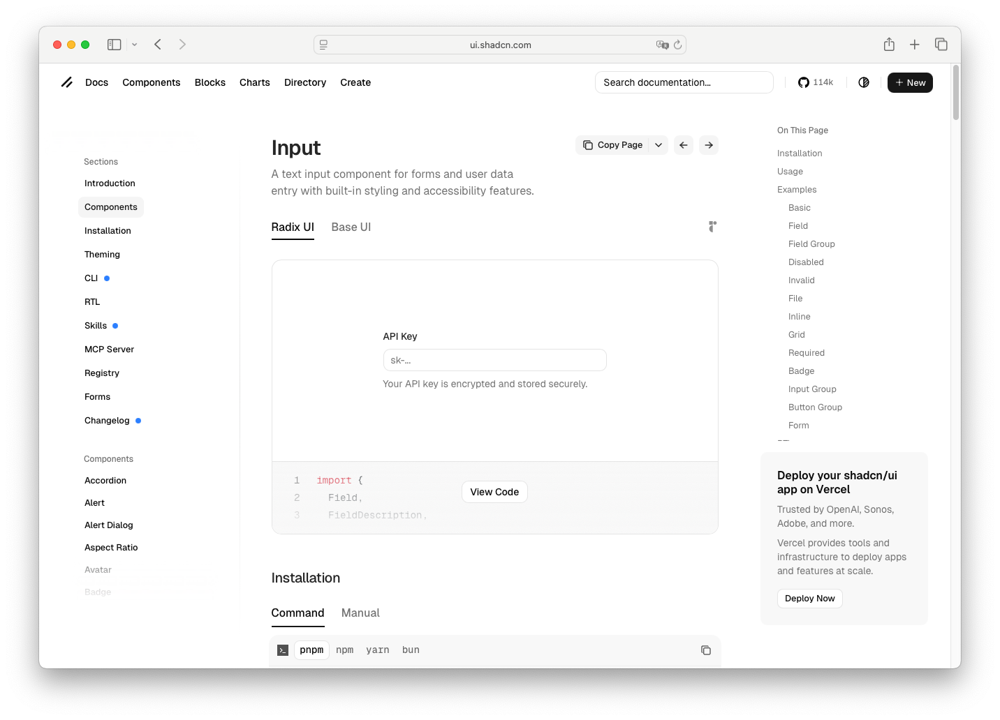

# Field Description

> Shinyblocks function: `block_field_description()`
> Shadcn reference: <https://ui.shadcn.com/docs/components/input>

## States

- **default** — muted helper text below the control.
- **error** — reused as `.sb-field-error` with destructive coloring when
  a field is invalid.
- **described-by** — may be linked from the control via
  `aria-describedby`.

## Token contract

| Visual role | Token |
| --- | --- |
| Helper text | `--muted-foreground` |
| Error text | `--destructive` |

## Deliberate divergences from shadcn

- shinyblocks reuses the same primitive for helper and error text
  instead of splitting them into separate exported helpers.

## Reference screenshot

Capture pending — use the shadcn form examples as the reference once
screenshots are being captured.
