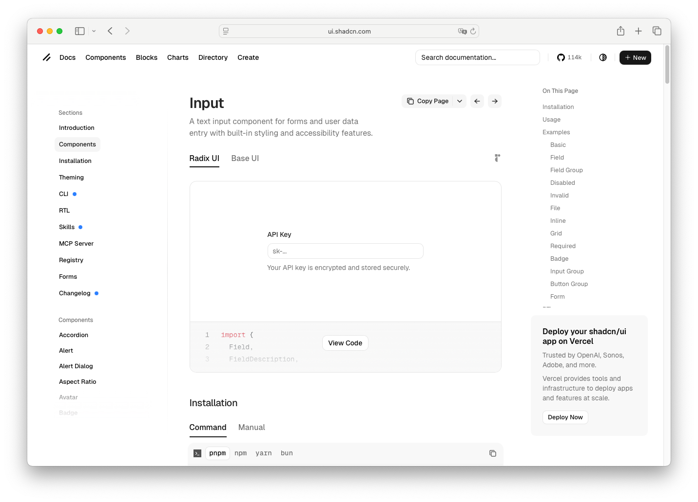

# Field Group

> Shinyblocks function: `block_field_group()`
> Shadcn reference: <https://ui.shadcn.com/docs/components/input>

## States

- **default** — vertical stack for one or more field wrappers with
  consistent inter-field spacing.
- **nested** — accepts `block_field()` and `block_field_set()` children
  without altering their own borders or focus states.

## Token contract

| Visual role | Token |
| --- | --- |
| Group spacing | none (layout only) |

## Deliberate divergences from shadcn

- `block_field_group()` is a composition wrapper. shadcn does not ship
  a direct one-to-one primitive for grouped fields.

## Reference screenshot

Capture pending — use a representative form grouping from the shadcn
form docs once the reference screenshot pass resumes.
