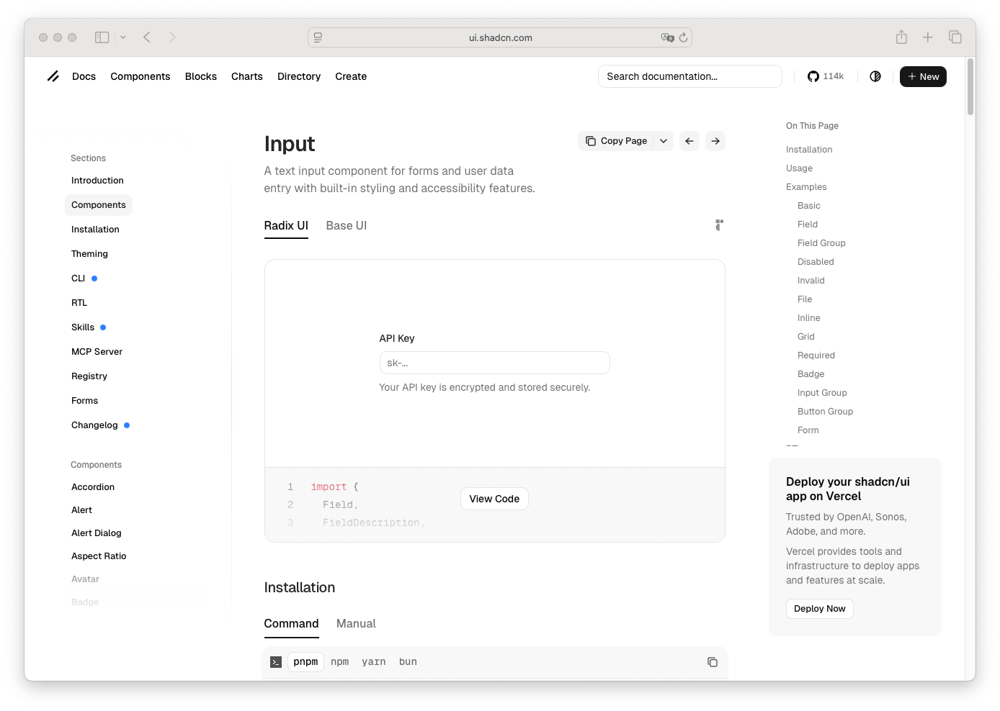

# Field Label

> Shinyblocks function: `block_field_label()`
> Shadcn reference: <https://ui.shadcn.com/docs/components/input>
> Status: Phase 5.13 — R-side composition primitive

## States

- **default** — compact label above the control with shadcn form text
  sizing.
- **invalid-context** — inherits the field's destructive treatment when
  paired with an invalid control.
- **associated** — forwards the `for` attribute to the wrapped input id.

## Token contract

| Visual role | Token |
| --- | --- |
| Label text | `--foreground` |

## Deliberate divergences from shadcn

- `block_field_label()` is a standalone helper instead of relying on an
  external `<Label />` primitive import.

## Reference screenshot

Captured from <https://ui.shadcn.com/docs/components/input> on 2026-05-11.
Refresh and update the date whenever shadcn updates the canonical look.
