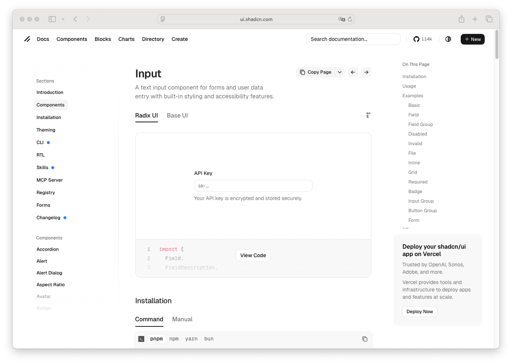

# Field Legend

> Shinyblocks function: `block_field_legend()`
> Shadcn reference: <https://ui.shadcn.com/docs/components/input>
> Status: Phase 5.13 — R-side composition primitive

## States

- **default** — compact group heading inside a fieldset.
- **with-controls** — sits above grouped controls without taking on
  focus or border treatment.

## Token contract

| Visual role | Token |
| --- | --- |
| Legend text | `--foreground` |

## Deliberate divergences from shadcn

- `block_field_legend()` exists as a separate export for R-side
  composition; upstream shadcn treats this as plain semantic markup.

## Reference screenshot

Captured from <https://ui.shadcn.com/docs/components/input> on 2026-05-11.
Refresh and update the date whenever shadcn updates the canonical look.
