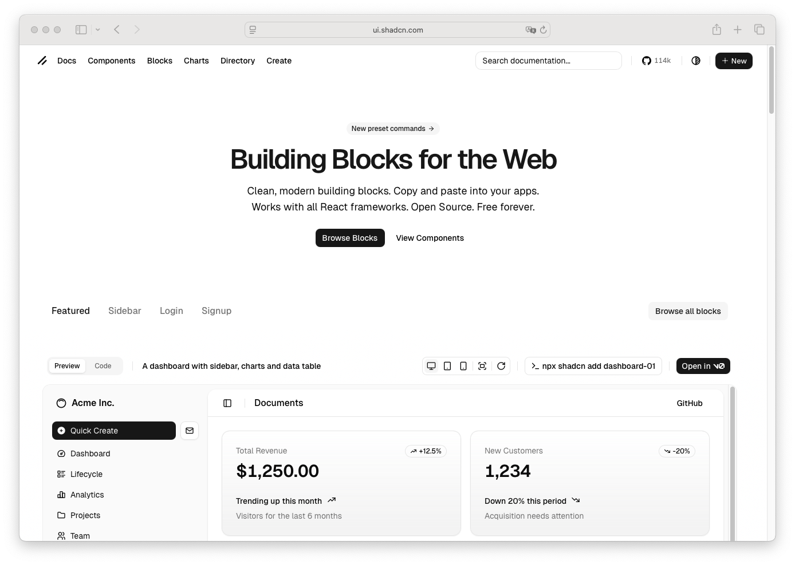

# Header

> Shinyblocks function: `block_header()`
> Shadcn reference: <https://ui.shadcn.com/blocks>
> Status: R-side layout primitive; Phase 7 spec refreshed around the
> shipped shell hook contract.

## States

- **default** — top page header band rendered as `<header class="sb-header">`.
- **with-sidebar-trigger** — composes beside the mobile sidebar
  trigger inside the page-owned `.sb-header-shell` wrapper when
  `block_page(sidebar = ...)` is used.
- **responsive** — remains usable in both sidebar and no-sidebar page
  shells.

## R API

| Argument | Purpose |
| --- | --- |
| `...` | Header content. |
| `class` | Extra classes for the `.sb-header` element. |

## Stable shell hooks

`block_header()` owns `.sb-header` and participates in the page-owned
`.sb-header-shell` wrapper when a sidebar trigger is present. Both
selectors stay package-owned shell contracts and are out of scope for
runtime-rendered component styling.

## Accessibility

- Rendered as a `<header>` landmark.
- The mobile sidebar trigger that may sit beside it carries its own
  ARIA wiring (`aria-controls`, `aria-expanded`, accessible label).

## Token contract

| Visual role | Token |
| --- | --- |
| Surface | `--background` |
| Foreground | `--foreground` |
| Border | `--border` |

## Deliberate divergences from shadcn

- `block_header()` packages a recurring app-shell pattern rather than
  a direct upstream shadcn component export.

## Reference screenshot

Captured from <https://ui.shadcn.com/blocks> on 2026-05-11.
Refresh and update the date whenever shadcn updates the canonical look.
