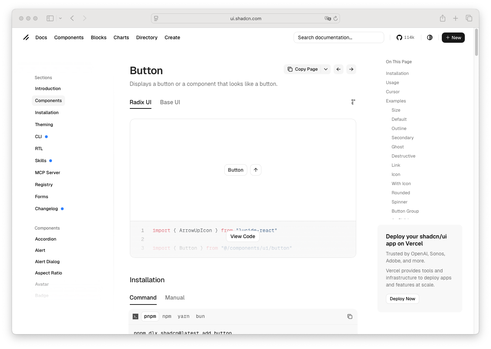

# Icon

> Shinyblocks function: `block_icon()`
> Shadcn reference: <https://ui.shadcn.com/docs/components/button>
> Status: R-side SVG-sprite helper; Phase 7 spec refreshed around the
> shipped manifest-as-source-of-truth contract.

## States

- **default** — inline `<svg>` symbol referenced from the vendored
  Lucide sprite via `<use href="…#sb-icon-<name>">`.
- **semantic colors** — optional foreground color class using the same
  semantic color choices as `block_spinner()`.
- **custom-tag** — when `name` is itself an `htmltools` tag, the helper
  passes it through, merging extra classes and attributes onto the
  supplied tag.
- **decorative** — defaults to `aria-hidden="true"` and
  `focusable="false"`. Callers that need a labelled icon must override
  these attributes explicitly.

## R API

| Argument | Purpose |
| --- | --- |
| `name` | Icon name from the curated manifest, or a custom `htmltools` tag to pass through. Unknown names error with a pointer to `inst/www/icons/MANIFEST.json`. |
| `size` | Icon size: `"default"` (1rem, the shadcn `size-4` default), `"sm"` (0.875rem), `"lg"` (1.5rem), `"xl"` (2.25rem). Maps to the `sb-icon-size-*` class. Ignored for custom-tag passthrough. |
| `class` | Additional classes merged onto the rendered tag. |
| `color` | Semantic foreground color: `"default"`, `"muted"`, `"primary"`, `"destructive"`, `"success"`, `"warning"`, or `"info"`. |
| `...` | Additional attributes passed to the root `<svg>` (or merged onto a custom passthrough tag). |

## Asset contract

- The curated icon list lives in `inst/www/icons/MANIFEST.json` and is
  the R-side source of truth. `validate_icon_name()` rejects names not
  in the manifest.
- The committed sprite at `inst/www/icons/sprite.svg` is a build
  artifact derived from the manifest; do not edit by hand.
- Sprite references include the asset version so cached sprites do not
  shadow newly-built ones across showcase restarts.

## Accessibility

- `aria-hidden="true"` and `focusable="false"` are set by default,
  treating icons as decorative.
- Callers that promote an icon to a labelled element (e.g. inside a
  trigger with no accompanying text) should override `aria-hidden` and
  pair the icon with an `aria-label` on the wrapping control.

## Token contract

| Visual role | Token |
| --- | --- |
| Icon color | `currentColor` |
| Muted icon color | `--muted-foreground` |
| Primary icon color | `--primary` |
| Destructive icon color | `--destructive` |
| Success icon color | `--success-foreground` |
| Warning icon color | `--warning-foreground` |
| Info icon color | `--info-foreground` |

## Deliberate divergences from shadcn

- shinyblocks serves icons from a local SVG sprite instead of
  importing Lucide React components per usage site.
- The curated icon list (manifest) is the R-side contract; runtime
  React code never queries the sprite directly to learn icon names.

## Reference screenshot

Captured from <https://ui.shadcn.com/docs/components/button> on 2026-05-11.
Refresh and update the date whenever shadcn updates the canonical look.
