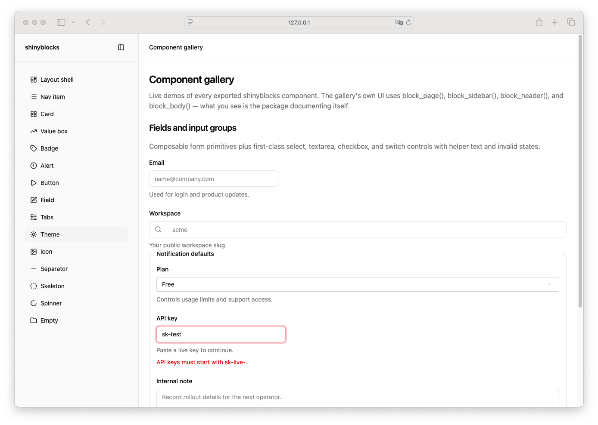

# Input Group Addon

> Shinyblocks function: `block_input_group_addon()`
> Shadcn reference: input-with-addon composition built from Input
> patterns
> Status: Phase 5.11 — ownership resolved as an R-side layout primitive

## States

- **default** — inline addon content aligned vertically with the
  wrapped input.
- **icon** — most common usage is a leading icon with muted foreground.
- **composed** — intended to live inside `block_input_group()`.

## Token contract

| Visual role | Token |
| --- | --- |
| Text/icon | `--muted-foreground` |
| Divider border | `--input` |

## Runtime ownership

`block_input_group_addon()` is a static R-side slot helper. It does not
own Shiny value binding or runtime state. Addons should be composed around
runtime controls such as `block_input()` when an interactive input is
needed.

## Deliberate divergences from shadcn

- shadcn does not ship a canonical standalone addon primitive; this is
  a shinyblocks composition helper.

## Reference screenshot

Captured from the local shinyblocks showcase on 2026-05-11.
Refresh and update the date whenever the shinyblocks reference treatment changes.
