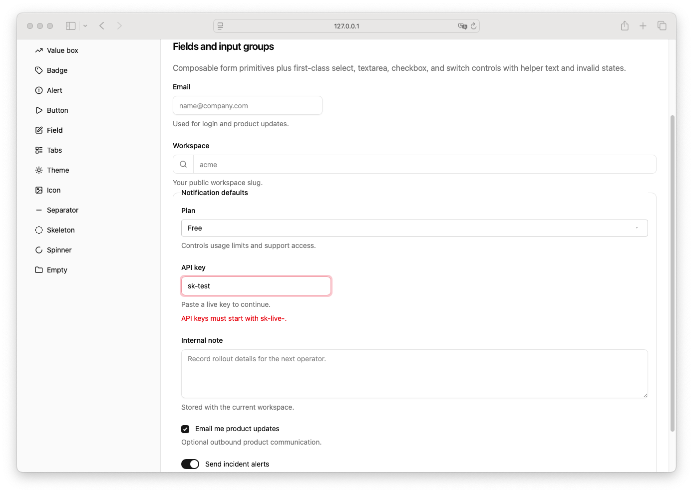

# Input Group

> Shinyblocks function: `block_input_group()`
> Shadcn reference: input-with-addon composition built from Input
> patterns

## States

- **default** — bordered shell wrapping addon and one input control.
- **focus-within** — 3px `--ring` shadow on the group shell.
- **invalid** — destructive ring when a child control carries
  `aria-invalid="true"`.
- **composed** — intended to wrap one control plus one or more addons.

## Token contract

| Visual role | Token |
| --- | --- |
| Surface | `--background` |
| Border | `--input` |
| Focus ring | `--ring` |
| Invalid ring | `--destructive`, `--border` |

## Deliberate divergences from shadcn

- shadcn does not ship a canonical standalone input-group component;
  this is a shinyblocks composition wrapper around the input contract.

## Reference screenshot

Captured from the local shinyblocks showcase on 2026-05-11.
Refresh and update the date whenever the shinyblocks reference treatment changes.
