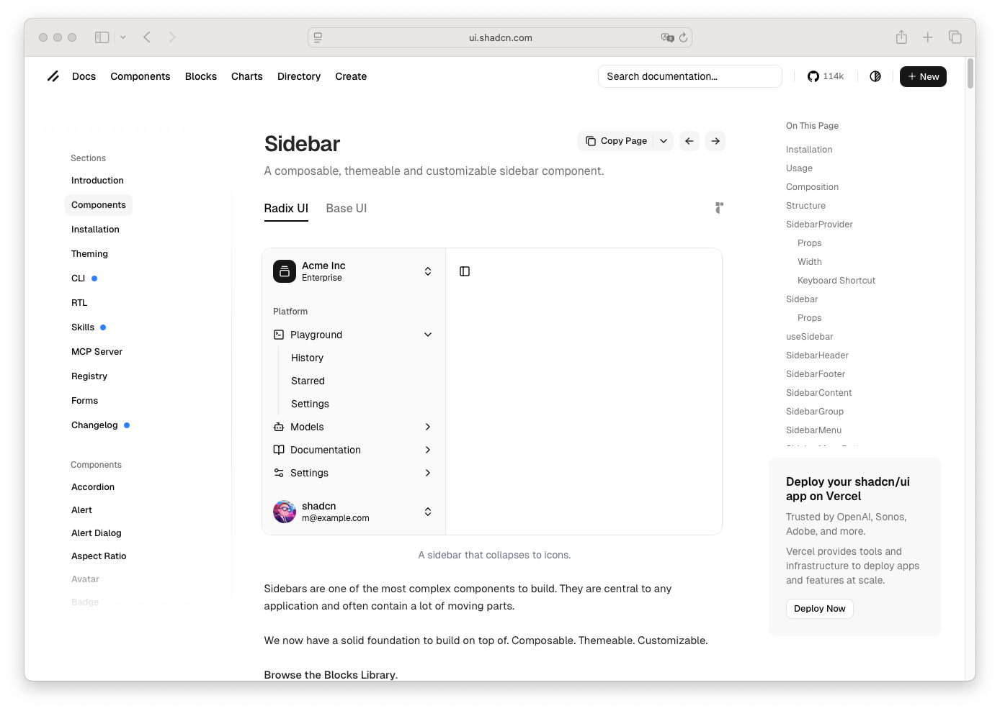

# Nav Item

> Shinyblocks function: `block_nav_item()`
> Shadcn reference: <https://ui.shadcn.com/docs/components/sidebar>
> Status: R-side navigation link; Phase 7 spec refreshed around the
> shipped link-first contract and `data-sb-child` marker.

## States

- **default** — sidebar navigation link rendered as `<a class="sb-nav-item">`
  with optional leading icon.
- **hover** — accent-tinted hover treatment.
- **focus-visible** — component-owned 3px `--ring` focus ring.
- **selected** — `selected = TRUE` adds `is-selected` and
  `aria-current="page"`.

## R API

| Argument | Purpose |
| --- | --- |
| `label` | Navigation label text. Rendered inside `.sb-nav-label`. |
| `href` | Destination URL. Defaults to `"#"`. |
| `icon` | Optional icon tag or vendored icon name. Forced to `inline-start` placement. |
| `selected` | Marks the item as the active page. |
| `class` | Extra classes for the `.sb-nav-item` element. |

## Stable shell hooks

`block_nav_item()` owns `.sb-nav-item`, the `is-selected` modifier,
and `.sb-nav-label`. It also stamps `data-sb-child="nav-item"` on the
element so `block_sidebar()` can detect direct nav-item children and
auto-wrap them into a single sidebar nav region.

## Accessibility

- Rendered as `<a>`.
- `aria-current="page"` is set when `selected = TRUE`.
- Sidebar runtime enables Up/Down/Home/End keyboard traversal across
  sibling items.

## Token contract

| Visual role | Token |
| --- | --- |
| Text | `--foreground` |
| Hover/selected surface | `--accent` |
| Hover/selected text | `--accent-foreground` |
| Focus ring | `--ring` |

## Deliberate divergences from shadcn

- `block_nav_item()` is link-first and lightweight; it does not carry
  the full React sidebar menu-button runtime, submenu, or tooltip
  composition.

## Reference screenshot

Captured from <https://ui.shadcn.com/docs/components/sidebar> on 2026-05-11.
Refresh and update the date whenever shadcn updates the canonical look.
