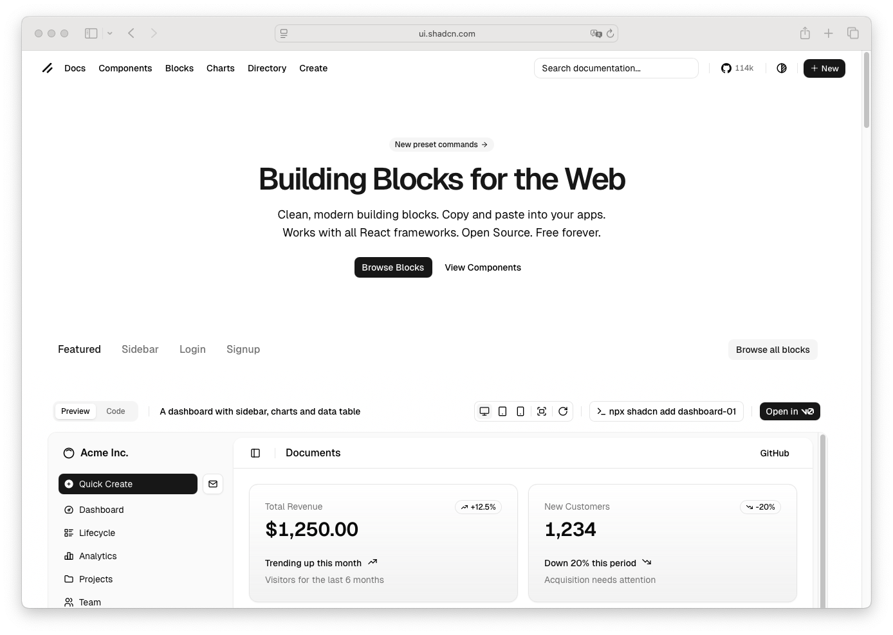

# Page

> Shinyblocks function: `block_page()`
> Shadcn reference: <https://ui.shadcn.com/blocks>

## States

- **default** — top-level app shell with optional header and body.
- **with-sidebar** — page root carries sidebar state attrs and renders
  the sidebar/backdrop/header-shell composition.
- **theme-mode** — serializes the requested initial mode (`system`,
  `light`, or `dark`) for the package theme runtime.
- **portal-owned** — keeps the runtime portal root inside the page
  shell so theme overrides and tokens apply to overlay/select portal
  content too.

## Token contract

| Visual role | Token |
| --- | --- |
| App surface | `--background` |
| App text | `--foreground` |

## Stable shell hooks

`block_page()` owns the `.sb-page`, `.sb-page-main`,
`.sb-header-shell`, and portal-root placement hooks. These hooks are
reserved for package shell layout and must not become dependencies for
runtime-rendered component visuals.

## Deliberate divergences from shadcn

- `block_page()` is a dashboard shell primitive rather than a direct
  one-to-one shadcn component.
- Theme bootstrapping is handled by the package `shinyblocks.js`
  runtime. `block_page()` only emits the initial mode configuration so
  the same runtime also owns dark-mode toggles and Shiny
  `update_block_theme()` messages.

## Reference screenshot

Captured from <https://ui.shadcn.com/blocks> on 2026-05-11.
Refresh and update the date whenever shadcn updates the canonical look.
