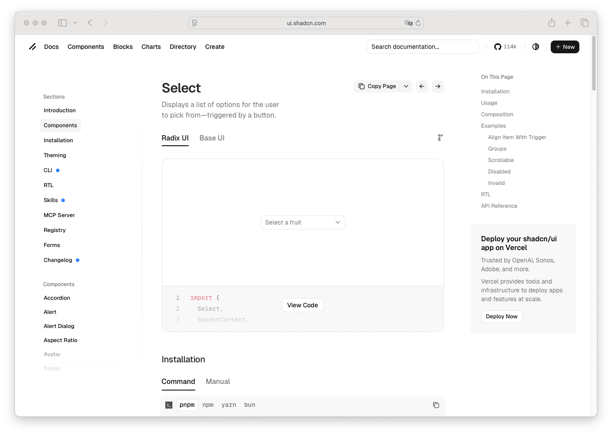

# Select

> Shinyblocks function: `block_select()` / `update_block_select()`
> Shadcn reference: <https://ui.shadcn.com/docs/components/select>
> Status: Runtime form control with a portal-rendered popup; Phase 7
> spec refreshed around the shipped binding, native value bridge, and
> updater contract.

## States

- **default** — custom runtime trigger and portal popup backed by a
  hidden native `<select>` that carries the Shiny value.
- **multiple** — `multiple = TRUE` emits a hidden native
  `<select multiple>` mirror and initializes to a character vector,
  defaulting to no selection.
- **changed** — user selection updates `input$<id>` through the
  component-specific Shiny input binding.
- **server-updated** — `update_block_select()` can update value,
  choices, placeholder, disabled state, style, and class.
- **focus-visible** — 3px `--ring` shadow on the visible trigger shell.
- **invalid** — destructive ring when `invalid = TRUE` is set.
- **disabled** — runtime disables the rendered control and preserves
  server updateability.
- **sizes** — `sm`, `default`, and `lg` adjust trigger height and
  horizontal padding while keeping typography aligned with shadcn.

## R API

### `block_select(input_id, choices, selected, placeholder, disabled, width, class, size, invalid, multiple, max_items)`

| Argument | Purpose |
| --- | --- |
| `input_id` | Shiny input id used for `input$<id>` and update messages. |
| `choices` | Character vector or named vector of labels/values. Values must be unique and non-empty; `""` is reserved as the placeholder sentinel. |
| `selected` | Initial selected value. In multiple mode, a character vector. |
| `placeholder` | Empty-value prompt shown before selection. |
| `disabled` | Disables browser interaction while keeping server updates possible. |
| `width` | CSS width for the runtime select wrapper. |
| `style` | Inline style on the runtime wrapper. |
| `class` | Additional class merged onto the runtime wrapper. |
| `size` | One of `default`, `sm`, or `lg`. |
| `invalid` | Applies `aria-invalid` and destructive border/ring styling. |
| `multiple` | Enables multiple-selection value semantics. |
| `max_items` | Optional selected-item cap for multiple mode. |

### `update_block_select(session, input_id, ...)`

Accepts `selected`, `choices`, `placeholder`, `disabled`, `width`, `class`,
`size`, and `invalid`, with optional `notify` semantics. (There is no `style`
argument — the inline `style` is set once at construction.) Passing
`selected = NULL` clears single selects to the empty placeholder value (`""`);
`selected = character(0)` clears multiple selects. A vector `selected` is for
multiple mode; reaching a single select it collapses to its first element.

## Runtime mapping

| R input | Runtime payload | Notes |
| --- | --- | --- |
| `input_id` | mount id | Drives `input$<id>` and message routing. |
| `choices` | `props$choices` | Array of `{ value, label }`. |
| `selected` | `state$value` | Initial value (or `""` for placeholder). |
| `placeholder` | `props$placeholder` | Prompt for the empty value. |
| `disabled` | `props$disabled` | Disables the visible control. |
| `invalid` | `props$invalid` | Toggles destructive-tinted state. |
| `size` | `props$size` | One of `sm`/`default`/`lg`. |
| `multiple` | `props$multiple` | Branches the runtime into multiple mode. |
| `max_items` | `props$maxItems` | Optional multiple-mode cap. |
| `width` | mount `style.width` | Applied to the wrapper. |
| `class` | `className` | Extra wrapper class. |

## Shiny state and update contract

- The visible UI is a package runtime overlay with shadcn-aligned
  trigger, content, viewport, item, and selected-indicator parts.
- A hidden `<select id="{input_id}" class="sb-select-native">` lives
  inside the runtime mount as the canonical Shiny value source. In
  multiple mode the native mirror carries the `multiple` attribute and
  selected options.
- `ShinyblocksSelectBinding` is registered as `shinyblocks.select`. It
  reads and updates the hidden native control while routing server
  messages through `receiveMessage()`.
- Single mode reports a length-1 string. Multiple mode reports a
  character vector and defaults to `character(0)`.
- The popup is rendered into the package portal root
  (`[data-shinyblocks-portal-root]`) to avoid `overflow`/`transform`
  clipping from ancestor containers.
- `update_block_select()` with cosmetic-only fields (style/class) does
  not notify. Value updates notify only when `notify = TRUE`.

## Stable styling hooks

- `.sb-select`
- `.sb-select-native`
- `.sb-select-trigger`
- `.sb-select-trigger-icon`
- `.sb-select-content`
- `.sb-select-viewport`
- `.sb-select-item`
- `.sb-select-item-indicator`
- `.sb-select-trigger-multi` (multiple-mode `div role="combobox"` trigger)
- `.sb-select-chips`, `.sb-select-chip`, `.sb-select-chip-remove`

The runtime also mirrors shadcn `data-slot` attributes for parity
tooling, but those are not the primary public styling hooks.

## Token contract

| Visual role | Token |
| --- | --- |
| Trigger surface | `--background` |
| Trigger border | `--input` |
| Trigger text | `--foreground` |
| Chevron | `--muted-foreground` |
| Focus ring | `--ring` |
| Invalid ring | `--destructive`, `--border` |
| Popup surface | `--popover` |
| Popup text | `--popover-foreground` |
| Chip surface | `--sb-select-chip-surface` → `--secondary` |
| Chip text | `--sb-select-chip-foreground` → `--secondary-foreground` |
| Chip border | `--sb-select-chip-border` → `--border` |

Multiple-mode chips and the `div role="combobox"` trigger are
token-driven; the `.sb-parity-multi-select` showcase fixture and
`tools/theme/theme-registry.mjs` `select` bindings prove chip
surface/text/border and trigger text re-color under dark mode and
`block_theme()` overrides.

## Deliberate divergences from shadcn

- The visible control is package-owned and React-rendered, not a
  Radix `Select` primitive. The hidden native `<select>` is retained as
  the canonical Shiny value source and accessibility fallback.
- Updater never accepts a `null` value — Shiny clears to `""` which is
  reserved as the placeholder sentinel.

## Reference screenshot

Captured from <https://ui.shadcn.com/docs/components/select> on 2026-05-11.
Refresh and update the date whenever shadcn updates the canonical look.
