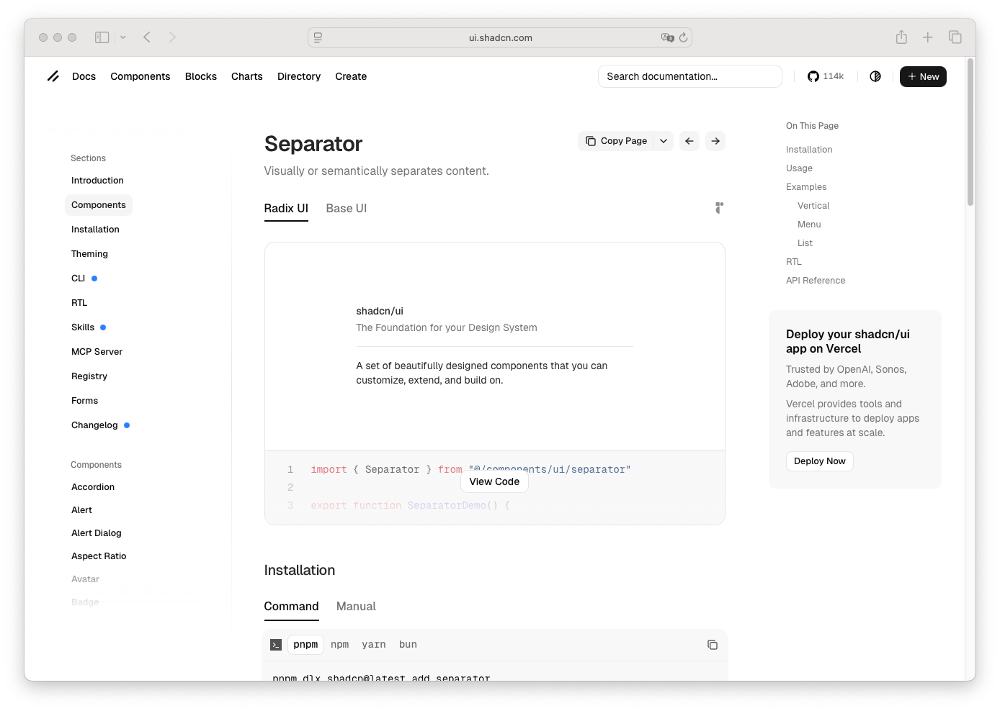

# Separator

> Shinyblocks function: `block_separator()`
> Shadcn reference: <https://ui.shadcn.com/docs/components/separator>
> Status: Runtime presentational component; Phase 7 spec refreshed
> around shipped orientation + decorative contract.

## States

- **horizontal** — full-width divider line.
- **vertical** — vertical divider for dense toolbars or inline layouts;
  the runtime stretches the divider via flex.
- **semantic** — exposes `role="separator"` and `aria-orientation` when
  `decorative = FALSE`.
- **decorative** — hidden from assistive tech by default
  (`aria-hidden="true"`).

## R API

| Argument | Purpose |
| --- | --- |
| `orientation` | `"horizontal"` (default) or `"vertical"`. |
| `decorative` | When `TRUE` (default) the separator is purely presentational and hidden from assistive tech. |
| `class` | Extra classes merged onto the runtime wrapper. |

## Runtime mapping

| R input | Runtime payload |
| --- | --- |
| `orientation` | `props$orientation` |
| `decorative` | `props$decorative` |
| `class` | `className` |

## Token contract

| Visual role | Token |
| --- | --- |
| Rule color | `--border` |

## Deliberate divergences from shadcn

- shinyblocks defaults separators to decorative because most uses in
  the package are presentational. Pass `decorative = FALSE` for
  semantically-meaningful dividers.

## Reference screenshot

Captured from <https://ui.shadcn.com/docs/components/separator> on 2026-05-11.
Refresh and update the date whenever shadcn updates the canonical look.
