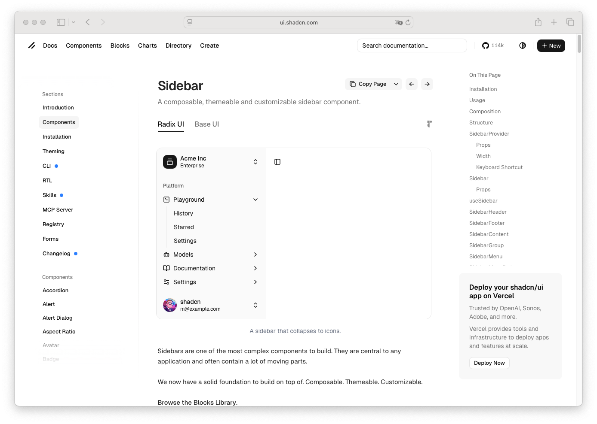

# Sidebar

> Shinyblocks function: `block_sidebar()`
> Shadcn reference: <https://ui.shadcn.com/docs/components/sidebar>
> Status: R-side shell primitive with a page-scoped runtime behavior
> layer; Phase 7 spec refreshed around shipped collapse/mobile-open
> behavior and the `block_nav()` composition rule.

## States

- **default** — bordered sidebar shell with optional title and nav region.
- **collapsible** — `collapsible = TRUE` exposes a desktop collapse
  toggle and sets `data-collapsible="true"` on `<aside>`.
- **collapsed** — `collapsed = TRUE` starts the sidebar in the
  desktop-collapsed state with `data-collapsed="true"`.
- **mobile-open** — the page-level runtime opens the sidebar as a
  sheet through the `data-sidebar-mobile-open` state on `.sb-page`,
  with backdrop click and Escape dismissal.
- **nav-composed** — when passed a single `block_nav()` container, the
  sidebar promotes that nav to the sidebar navigation region instead
  of nesting a second `<nav>` landmark. Direct `block_nav_item()`
  children are wrapped into one sidebar nav region automatically.

## R API

| Argument | Purpose |
| --- | --- |
| `...` | Sidebar content. Direct `block_nav_item()` children get auto-wrapped into one sidebar nav region; a single `block_nav()` child is promoted in place. |
| `title` | Optional sidebar title. Rendered inside `.sb-sidebar-title`. |
| `collapsible` | Whether the sidebar can collapse on larger screens. Adds the desktop toggle button when `TRUE`. |
| `collapsed` | Whether the sidebar starts collapsed on larger screens. |
| `id` | Optional DOM id. `block_page()` defaults this to `"sb-sidebar"` when omitted, so the mobile trigger's `aria-controls` can target it. |
| `class` | Extra classes for the `.sb-sidebar` element. |

## Runtime behavior

The sidebar is R-side markup, but its open/collapse state is driven by
the package `shinyblocks.js` runtime through `.sb-page`'s `data-sidebar-*`
attributes:

- Mobile trigger click toggles `data-sidebar-mobile-open` on the page.
- Desktop toggle click toggles `data-sidebar-collapsed`.
- Backdrop click, outside click on the page, and Escape close an open
  mobile sidebar.
- Arrow/Home/End traversal across child `.sb-nav-item` elements when
  the sidebar contains a nav region (see Nav).

## Stable shell hooks

`block_sidebar()` owns `.sb-sidebar`, `.sb-sidebar-title`,
`.sb-sidebar-title-text`, `.sb-sidebar-nav`, `.sb-sidebar-toggle`, and
`.sb-sidebar-mobile-trigger`, plus the `data-collapsible`/
`data-collapsed` attributes on `<aside>`. The page-level
`.sb-sidebar-backdrop` is emitted by `block_page()`. These hooks are
package shell contracts for layout, navigation, and responsive
sidebar behavior only.

## Accessibility

- Rendered as `<aside>` with an id that matches the mobile trigger's
  `aria-controls`.
- Desktop toggle is `<button aria-label="Toggle sidebar">` with
  `aria-expanded` reflecting the collapsed state.
- A single nav region per sidebar — the `block_nav()` promotion rule
  avoids nested `<nav>` landmarks.

## Token contract

| Visual role | Token |
| --- | --- |
| Surface | `--sidebar` |
| Foreground | `--sidebar-foreground` |
| Border | `--sidebar-border` |
| Focus ring | `--ring` |

## Deliberate divergences from shadcn

- shinyblocks keeps the sidebar runtime small and page-scoped instead
  of porting the full React sidebar-provider model.
- Collapse/mobile-open state lives on the page element via data
  attributes; there is no React context or provider component.

## Reference screenshot

Captured from <https://ui.shadcn.com/docs/components/sidebar> on 2026-05-11.
Refresh and update the date whenever shadcn updates the canonical look.
