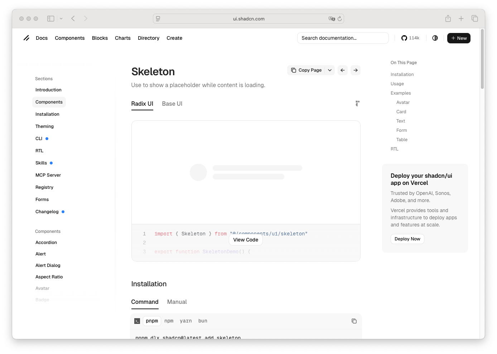

# Skeleton

> Shinyblocks function: `block_skeleton()`
> Shadcn reference: <https://ui.shadcn.com/docs/components/skeleton>

## States

- **default** — animated muted placeholder block.
- **custom-size** — caller-controlled dimensions through classes or
  extra attrs.
- **decorative** — always `aria-hidden="true"`.

## Token contract

| Visual role | Token |
| --- | --- |
| Placeholder surface | `--accent` |

## Deliberate divergences from shadcn

- shinyblocks exposes the skeleton as a plain `div` helper with attrs
  passthrough instead of a framework-specific utility component.

## Reference screenshot

Capture pending — use the canonical shadcn skeleton docs page once
screenshots are being captured.
