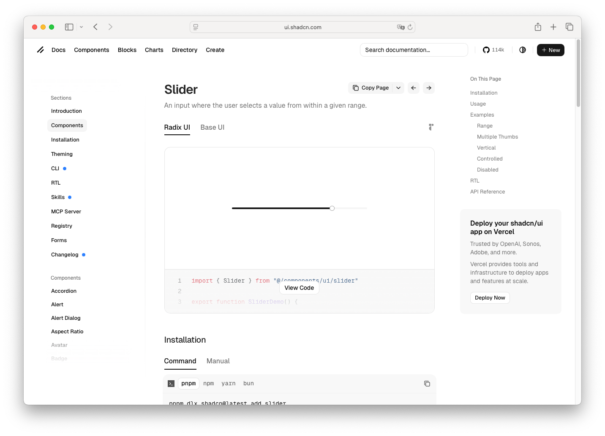

# Slider

> Shinyblocks function: `block_slider()` / `update_block_slider()`
> Shadcn reference: <https://ui.shadcn.com/docs/components/slider>
> Status: Runtime form control with a hidden native input bridge;
> Phase 7 spec refreshed around shipped pointer/keyboard runtime,
> range/single modes, and updater contract.

## States

- **default** — muted rail (6px tall, fully rounded), primary-filled
  range, 16px white thumb with primary border and a soft shadow.
- **hover** (on thumb) — 4px ring at 50% `--ring` opacity around the
  thumb. Rail and range unchanged.
- **focus-visible** (on thumb) — same 4px `--ring/50` ring as hover,
  default browser outline suppressed.
- **range mode** — two thumbs; filled range sits between them.
- **disabled** — entire slider at 0.5 opacity, pointer-events
  disabled, thumb cursor `not-allowed`.
- **invalid** — thumb border/ring switches to destructive styling via
  `aria-invalid="true"`.
- **server update** — `update_block_slider()` can update value, min,
  max, step, disabled, invalid, style, and class.
- **standalone width** — sliders keep a small runtime minimum width in
  shrink-wrapped containers while explicit `width` / parent constraints
  can still size the control.

## R API

### `block_slider(input_id, value, min, max, step, ticks, width, disabled, invalid, style, class)`

| Argument | Purpose |
| --- | --- |
| `input_id` | Shiny input id used for `input$<id>` and update messages. |
| `value` | One or two numeric values. Two values activates range mode. |
| `min` / `max` | Numeric bounds. `min` must be strictly less than `max`. |
| `step` | Optional positive numeric step. |
| `ticks` | Accepted for API compatibility — tick labels are not currently rendered. |
| `width` | CSS width applied to the runtime wrapper. |
| `disabled` | Disables pointer/keyboard interaction. |
| `invalid` | Applies `aria-invalid` and destructive border/ring. |
| `style` / `class` | Inline style / extra class on the wrapper. |

### `update_block_slider(session, input_id, ...)`

Accepts `value`, `min`, `max`, `step`, `disabled`, `invalid`, `style`,
`class`, with optional `notify` semantics. `value` accepts one or two
numerics matching single vs range mode.

## Runtime mapping

| R input | Runtime payload | Notes |
| --- | --- | --- |
| `input_id` | mount id | Drives `input$<id>`. |
| `value` | `state$value` | Numeric scalar or two-number array. |
| `min`/`max`/`step` | `props$min` / `props$max` / `props$step` | |
| `ticks` | (ignored) | Accepted for API compatibility; the runtime does not render tick labels yet. |
| `disabled` | `props$disabled` | |
| `invalid` | `props$invalid` | |
| `width` | mount `style.width` | |

A hidden native `<input>` lives in the runtime mount as a
form-submission bridge, but Shiny reads the dedicated
`shinyblocks.slider` binding from the runtime root.

## Shiny state and update contract

- Single-value sliders report a numeric scalar to Shiny; range sliders
  report a two-number array.
- Pointer dragging, click-to-position, Home/End, ArrowLeft/Right,
  ArrowUp/Down, and PageUp/PageDown are handled by the runtime.
- Server-driven value updates can notify Shiny (`notify = TRUE`,
  default) or remain cosmetic/state-only (`notify = FALSE`).

## Token contract

| Visual role | Token (light) | Token (dark override) |
| --- | --- | --- |
| Rail (track) fill | `--muted` | `--ring` |
| Range fill | `--primary` | same |
| Thumb surface | `#ffffff` (literal white, matches shadcn) | same |
| Thumb border | `--primary` | `--border` |
| Thumb shadow | `--foreground` at 5% / 10% (shadow-sm) | same |
| Hover / focus ring | `--ring` at 50% opacity, 4px wide | same |
| Invalid ring | `--destructive` at 20% opacity | same |
| Disabled opacity | `0.5` | same |
| Rail / range / thumb radius | `9999px` (fully rounded) | same |
| Rail / range height | `0.375rem` (6px) | same |
| Thumb size | `1rem` (16px) | same |
| Standalone minimum width | `min(12rem, 100%)` | same |

## Deliberate divergences from shadcn

- The DOM is package-local React runtime markup, not
  `@radix-ui/react-slider`, but it uses the same slot names:
  `[data-slot="slider"]`, `[data-slot="slider-track"]`,
  `[data-slot="slider-range"]`, and `[data-slot="slider-thumb"]`.
- `block_slider()` no longer wraps `shiny::sliderInput()` /
  ion.rangeSlider — the runtime owns the visible control end-to-end.
- `ticks` remains accepted for API compatibility but the runtime does
  not render tick labels yet.
- Thumb surface is a literal `#ffffff` (matches shadcn's `bg-white`)
  rather than `--background`, so the thumb stays light in dark mode
  exactly as shadcn does it.
- No vertical orientation today; shinyblocks only supports horizontal
  sliders for now.
- **Dark-mode colour refinement.** In dark mode, the default token
  mapping produces a near-invisible track (`--muted` = `oklch(0.269)`
  on `oklch(0.145)` background). shinyblocks overrides the slider track
  in dark mode to `--ring` and the handle border to `--border`. The
  range bar keeps `--primary`.

## Reference screenshot

Captured from <https://ui.shadcn.com/docs/components/slider> on 2026-05-11.
Refresh and update the date whenever shadcn updates the canonical look.
