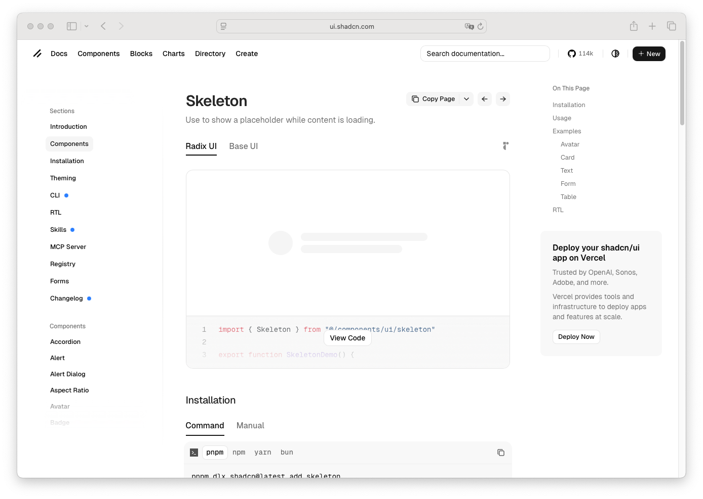

# Spinner

> Shinyblocks function: `block_spinner()`
> Shadcn reference: <https://ui.shadcn.com/docs/components/skeleton>
> Status: Runtime presentational component; Phase 7 spec refreshed
> around shipped accessible-label contract.

## States

- **default** — compact animated loading indicator with a scoped
  rotation animation under `[data-shinyblocks-root]`.
- **accessible** — exposes `role="status"` and an `aria-label` so
  screen readers announce the loading state.

## R API

| Argument | Purpose |
| --- | --- |
| `label` | Accessible label. Defaults to `"Loading"`. |
| `class` | Extra classes merged onto the runtime wrapper. |

## Runtime mapping

| R input | Runtime payload |
| --- | --- |
| `label` | `props$label` → `aria-label` |
| `class` | `className` |

## Token contract

| Visual role | Token |
| --- | --- |
| Spinner stroke | `--muted-foreground` |

## Deliberate divergences from shadcn

- shadcn does not ship a dedicated spinner primitive. shinyblocks adds
  one for Shiny loading states while keeping the same token language
  and animation timing as the runtime skeleton.

## Reference screenshot

Captured from <https://ui.shadcn.com/docs/components/skeleton> on 2026-05-11.
Refresh and update the date whenever shadcn updates the canonical look.
