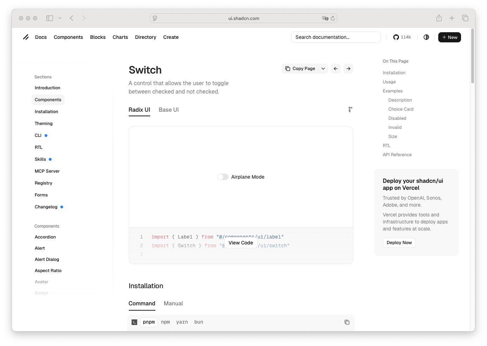

# Switch

> Shinyblocks function: `block_switch()`
> Shadcn reference: <https://ui.shadcn.com/docs/components/switch>

## States

- **default** — rounded track with a thumb at the leading edge and
  inline label text.
- **checked** — primary-filled track with the thumb translated to the
  trailing edge.
- **focus-visible** — 3px `--ring` shadow at 50% opacity around the
  track.
- **disabled** — reduced opacity for both track and label.
- **invalid** — destructive-tinted border when wrapped in
  `block_field_invalid()`.

## Token contract

| Visual role | Token |
| --- | --- |
| Track off | `--input` |
| Track on | `--primary` |
| Thumb | `--background` |
| Text | `--foreground` |
| Focus ring | `--ring` |
| Invalid border | `--destructive`, `--border` |

## Deliberate divergences from shadcn

- `block_switch()` wraps `shiny::checkboxInput()` rather than emitting
  a bespoke switch runtime. Checked state still comes from the native
  checkbox input.

## Reference screenshot

Capture pending — pull the canonical screenshot from
<https://ui.shadcn.com/docs/components/switch> and refresh it when the
upstream component changes.
