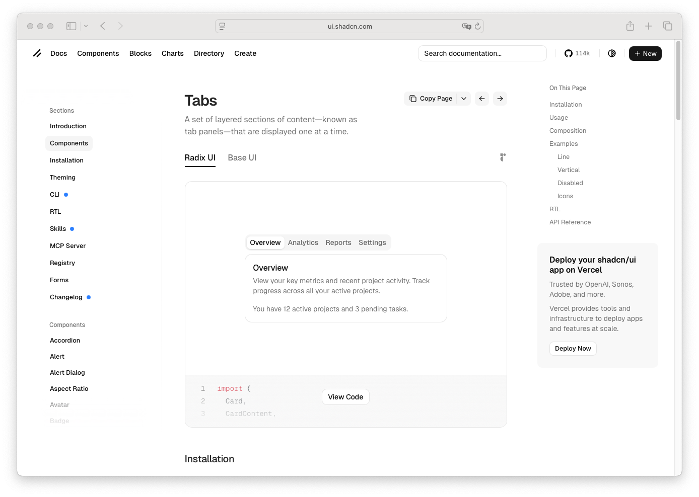

# Tab

> Shinyblocks function: `block_tab()`
> Shadcn reference: <https://ui.shadcn.com/docs/components/tabs>

## States

- **default** — wraps a Shiny `tabPanel()` and carries no standalone
  styling until rendered inside `block_tabs()`.
- **selected** — delegated to the parent tabset; the matching trigger
  receives `.active`.
- **content** — content is rendered inside Bootstrap's `.tab-pane`
  container and inherits shinyblocks surface/content styling around it.

## Token contract

| Visual role | Token |
| --- | --- |
| Trigger/content styling | delegated to `block_tabs()` |
| Active state | delegated to `block_tabs()` |
| Focus ring | delegated to `block_tabs()` |

## Deliberate divergences from shadcn

- `block_tab()` is sugar over `shiny::tabPanel()`, not a standalone DOM
  primitive like shadcn's `TabsContent`.
- Selection and keyboard behavior are owned by Shiny/Bootstrap through
  the parent `block_tabs()` wrapper.

## Reference screenshot

Captured from <https://ui.shadcn.com/docs/components/tabs> on 2026-05-11.
Refresh and update the date whenever shadcn updates the canonical look.
