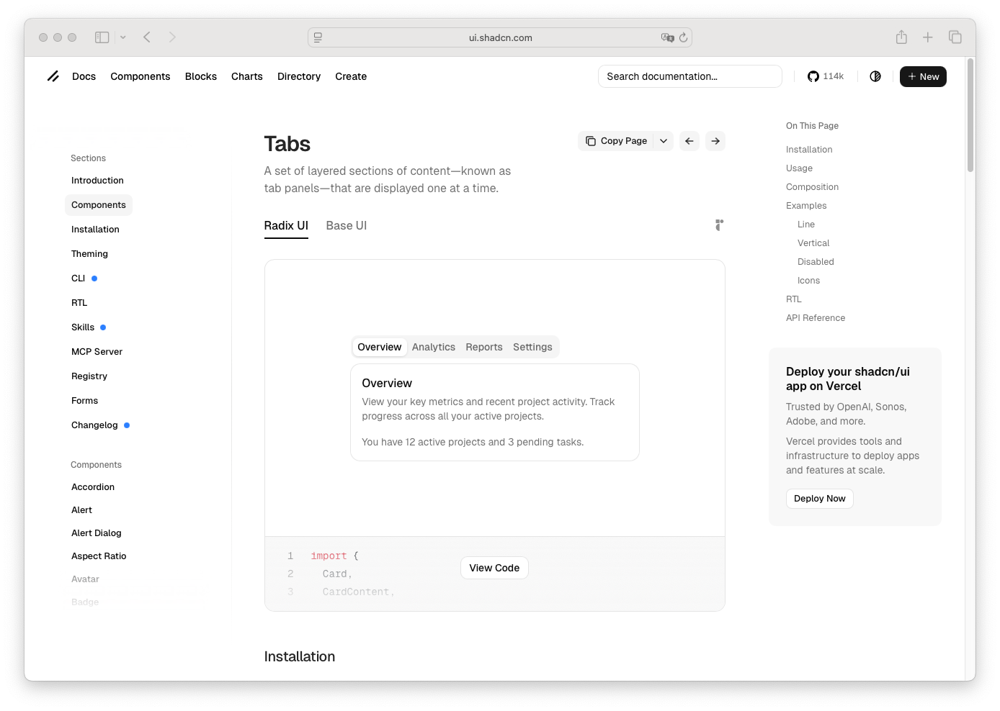

# Tabs

> Shinyblocks function: `block_tabs()`
> Shadcn reference: <https://ui.shadcn.com/docs/components/tabs>
> Status: R-side composition primitive with a local Shiny value
> bridge; Phase 7 spec refreshed around the shipped package-owned
> markup and local selection runtime.

## States

- **default** — muted rounded list surface, inline triggers, and card
  content beneath.
- **line** — transparent list surface with an active underline
  indicator.
- **hover** — inactive triggers keep transparent background and lift
  label color from muted to foreground.
- **selected** — active trigger uses `--background` fill,
  `--foreground` text, and a light shadow inside the muted list for
  the default variant; line variant uses only the underline.
- **focus-visible** — trigger owns its own 3px `--ring` shadow at 50%
  opacity instead of relying on a global outline fallback.
- **orientation** — markup carries `data-orientation` and supports
  both `horizontal` and `vertical`.
- **content** — tab content renders inside package-owned
  `.sb-tabs-content` / `.sb-tabs-panel` containers.

## R API

| Argument | Purpose |
| --- | --- |
| `...` | `block_tab()` items. Bare `shiny::tabPanel()` tags are also accepted as a compatibility source — their `title` attribute is read and the rendered DOM is rewritten into the package-owned contract. |
| `id` | Optional Shiny input id. When provided, the selected tab value is pushed to `input$<id>`. |
| `selected` | Optional initial value. Defaults to the first tab; invalid values silently fall back to the first tab. |
| `variant` | `default` or `line`. |
| `orientation` | `horizontal` or `vertical`. |
| `class` | Extra classes merged onto the `.sb-tabs` element. |

## Rendered contract

`block_tabs()` emits a self-contained DOM tree (no Radix runtime):

- `.sb-tabs[data-sb-tabs="true"]` root carrying
  `data-sb-tabs-input-id` (when `id` is set), `data-orientation`,
  `data-variant`.
- `.sb-tabs-list[role="tablist"]` containing one `.sb-tabs-trigger`
  `<button role="tab">` per tab, each with `aria-selected`,
  `aria-controls`, `tabindex`, `data-value`, and `data-state`.
- `.sb-tabs-content` containing one `.sb-tabs-panel`
  `
` per tab. Inactive panels are
  `hidden`/`data-state="inactive"`.

No `nav-link`, `tab-pane`, or `shiny-tab-input` classes appear in the
rendered contract.

## Shiny state contract

- When `id` is supplied, the local `shinyblocks.js` tabs runtime
  pushes the active `data-value` to `input$<id>`.
- Selection, keyboard behaviour (Arrow/Home/End), `aria-selected`,
  `data-state`, and panel visibility are owned by the local runtime.

## Token contract

| Visual role | Token |
| --- | --- |
| Tabs list surface | `--muted` |
| Inactive trigger text | `--muted-foreground` |
| Hover trigger text | `--foreground` |
| Active trigger surface | `--background` |
| Active trigger text | `--foreground` |
| Line indicator | `--foreground` |
| Focus ring | `--ring` |

## Deliberate divergences from shadcn

- `block_tabs()` is an R-side helper, not a React/Radix runtime
  component. It emits package-owned markup and lets the local
  `shinyblocks.js` runtime handle selection/keyboard/ARIA.
- `shiny::tabPanel()` is accepted at the input boundary as a
  compatibility convenience, but the rendered DOM is always the
  package-owned contract above — no Bootstrap tab classes leak through.

## Reference screenshot

Captured from <https://ui.shadcn.com/docs/components/tabs> on 2026-05-11.
Refresh and update the date whenever shadcn updates the canonical look.
