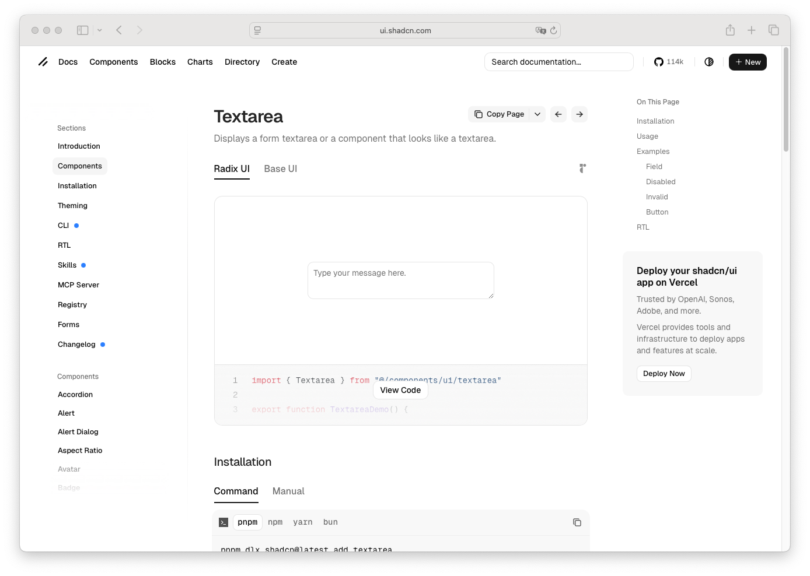

# Textarea

> Shinyblocks function: `block_textarea()`
> Shadcn reference: <https://ui.shadcn.com/docs/components/textarea>

## States

- **default** — full-width multiline control with shadcn textarea
  spacing, radius, border, and text sizing.
- **placeholder** — muted foreground placeholder text inside the
  control.
- **focus-visible** — 3px `--ring` shadow at 50% opacity with the
  border promoted to `--ring`.
- **disabled** — reduced opacity and no pointer interaction.
- **invalid** — destructive-tinted border when wrapped in
  `block_field_invalid()`.

## Token contract

| Visual role | Token |
| --- | --- |
| Surface | `--background` |
| Text | `--foreground` |
| Placeholder | inherited muted foreground |
| Border | `--input` |
| Focus ring | `--ring` |
| Invalid border | `--destructive`, `--border` |

## Deliberate divergences from shadcn

- `block_textarea()` wraps `shiny::textAreaInput()` markup instead of
  emitting a standalone primitive.

## Reference screenshot

Captured from <https://ui.shadcn.com/docs/components/textarea> on 2026-05-11.
Refresh and update the date whenever shadcn updates the canonical look.
