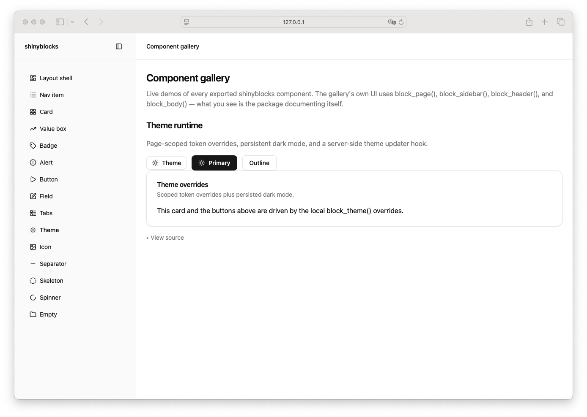

# Theme

> Shinyblocks function: `block_theme()` / `update_block_theme()`
> Shadcn reference: token theming model at <https://ui.shadcn.com/docs/theming>
> Status: R-side token override emitter paired with a runtime mode
> driver; Phase 7 spec refreshed around shipped token validation,
> page-scoped CSS, and the package theme runtime.

## States

- **default** — emits a `<style class="sb-theme-overrides">` tag with a
  `.sb-app{...}` rule containing the supplied CSS custom-property
  overrides.
- **overridden** — supplied token values replace the vendored defaults
  for every component inside the page shell, including runtime portal
  content (because the portal root sits inside `.sb-app`).
- **server-updated mode** — `update_block_theme()` sends a Shiny
  `sb:theme` custom message; the package `shinyblocks.js` runtime
  applies the mode and updates the document's `data-theme` attribute.

## R API

### `block_theme(...)`

| Argument | Purpose |
| --- | --- |
| `...` | Named CSS token overrides. Names must match the curated token list (see below). Values are emitted as `--<name>: <value>;`. |

Unnamed arguments or unknown token names raise an error at construction.

### `update_block_theme(session, mode)`

| Argument | Purpose |
| --- | --- |
| `session` | Shiny session (defaults to `getDefaultReactiveDomain()`). |
| `mode` | `"system"`, `"light"`, or `"dark"`. |

The updater does not mutate token values emitted by `block_theme()`; it
only changes the active light/dark/system resolution.

## Supported token names

`radius`, `background`, `foreground`, `card`, `card-foreground`,
`popover`, `popover-foreground`, `primary`, `primary-foreground`,
`secondary`, `secondary-foreground`, `muted`, `muted-foreground`,
`accent`, `accent-foreground`, `destructive`, `destructive-foreground`,
`border`, `input`, `ring`, `sidebar`, `sidebar-foreground`,
`sidebar-primary`, `sidebar-primary-foreground`, `sidebar-accent`,
`sidebar-accent-foreground`, `sidebar-border`, `sidebar-ring`,
`chart-1`–`chart-5`. The source of truth is `theme_token_names()` in
`R/theme.R`.

## Runtime behavior

- `block_page(theme_mode = ...)` writes the initial mode into
  `window.shinyblocksInitialThemeMode`. The package theme runtime reads
  that, applies the resolved mode, and listens for `sb:theme` messages.
- The runtime sets `document.documentElement.dataset.theme` and updates
  any `[data-sb-theme-toggle]` button's `aria-pressed` state.
- `block_dark_mode_toggle()` is a thin wrapper around `block_button()`
  that ships `data-sb-theme-toggle="true"` so the runtime can attach
  delegated click handling.

## Token contract

| Visual role | Token |
| --- | --- |
| Override scope | `.sb-app { --<token>: <value> }` |

## Deliberate divergences from shadcn

- `block_theme()` is an R helper that emits a single `<style>` tag
  scoped to `.sb-app`; shadcn itself expects the host app to own the
  CSS variable source files.
- Mode application and toggle wiring live in the package
  `shinyblocks.js` runtime, not in user-authored JS. `block_theme()`
  has no runtime payload of its own — only `update_block_theme()`
  routes through the Shiny bridge.

## Reference screenshot

Captured from the local shinyblocks showcase on 2026-05-11.
Refresh and update the date whenever the shinyblocks reference treatment changes.
